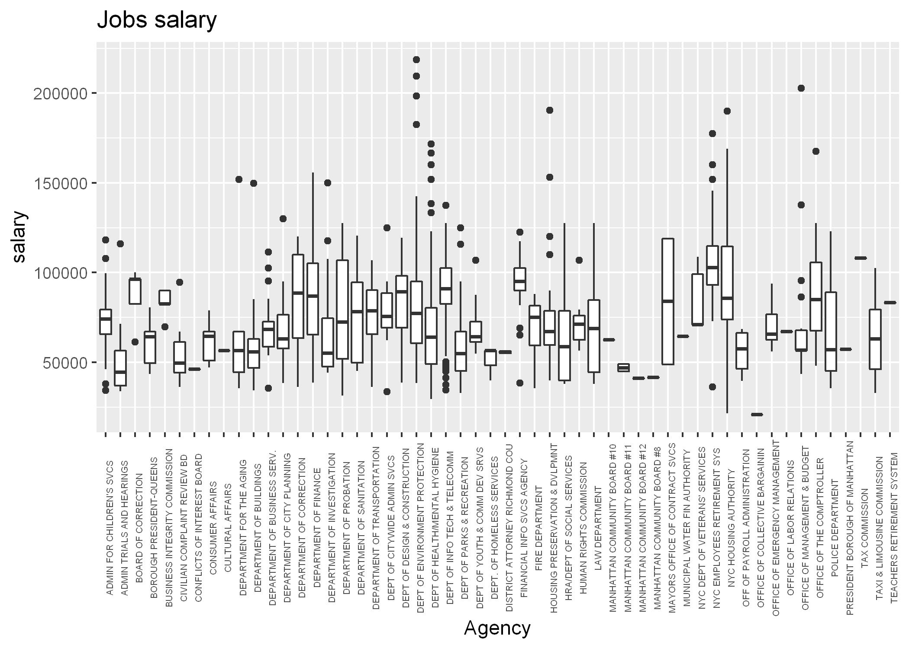
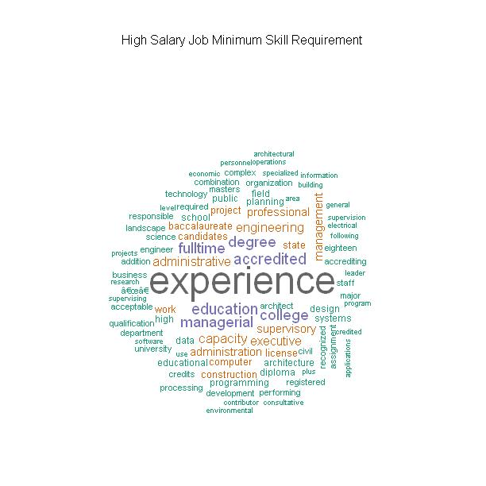
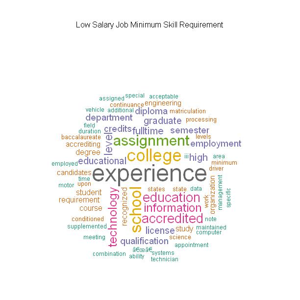
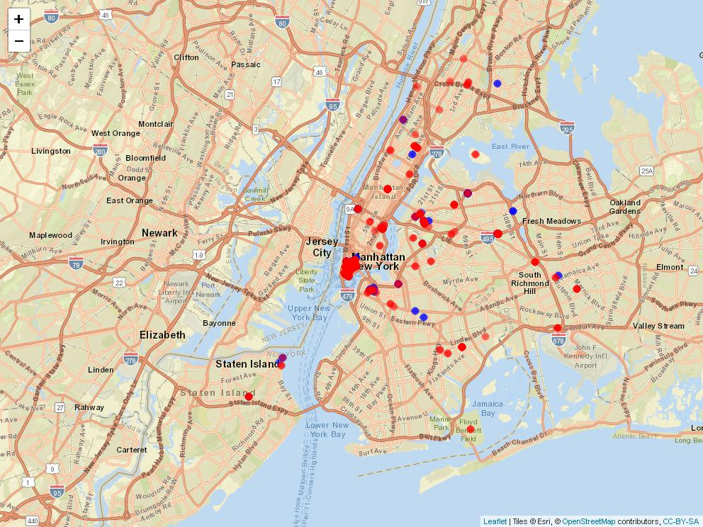

# Looking through NYC Jobs

In this particular project, I look through the job posting data of New York City. The data is provided on kaggle and can be accessed via the following link: https://www.kaggle.com/new-york-city/new-york-city-current-job-postings

With the analysis, I try to answer the following questions:

1.  The number of jobs posted and which agency has posted highest and lowest number of jobs

2.  The salary distribution with respect to differenct agencies

3.  What are the minimum qualification required for high paying jobs and lowing jobs?

4.  Where are the high paying and low paying jobs located in NY

## Result

The result of analysis can be found in the html file "r_notebook.html".

The graphs and any other generated data is stored in output folder.

1.  Most of the jobs fall in the bracket of (50k, 100k)$.

2.  For both low and high paying jobs, experience seems to be the most important required qualification.

3.  One of the interesting thing was that high paying jobs are not as distributed as low paying jobs across NY city.

